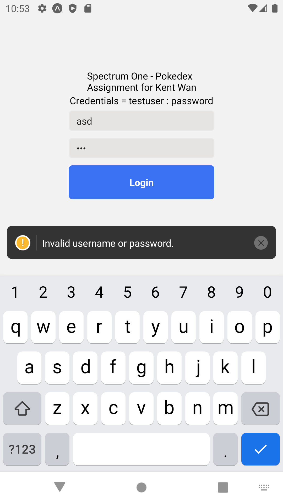
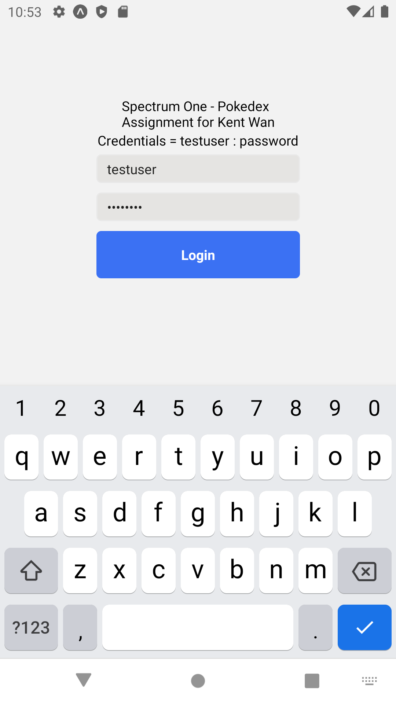
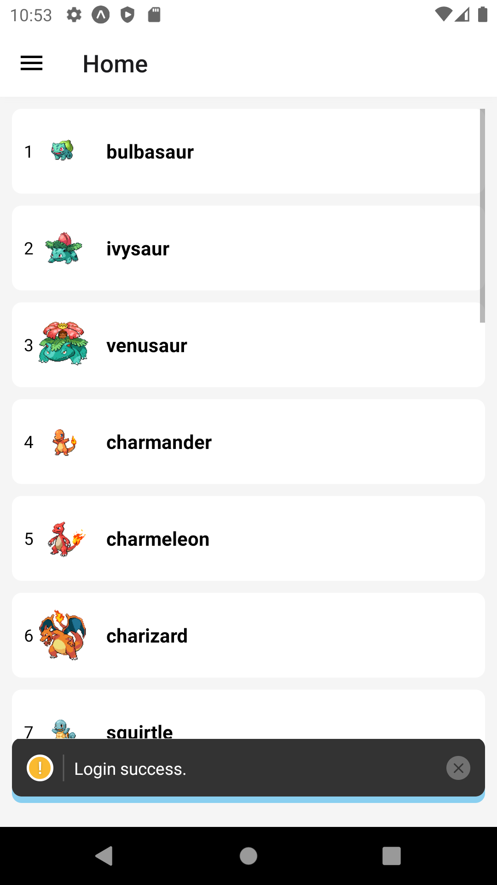
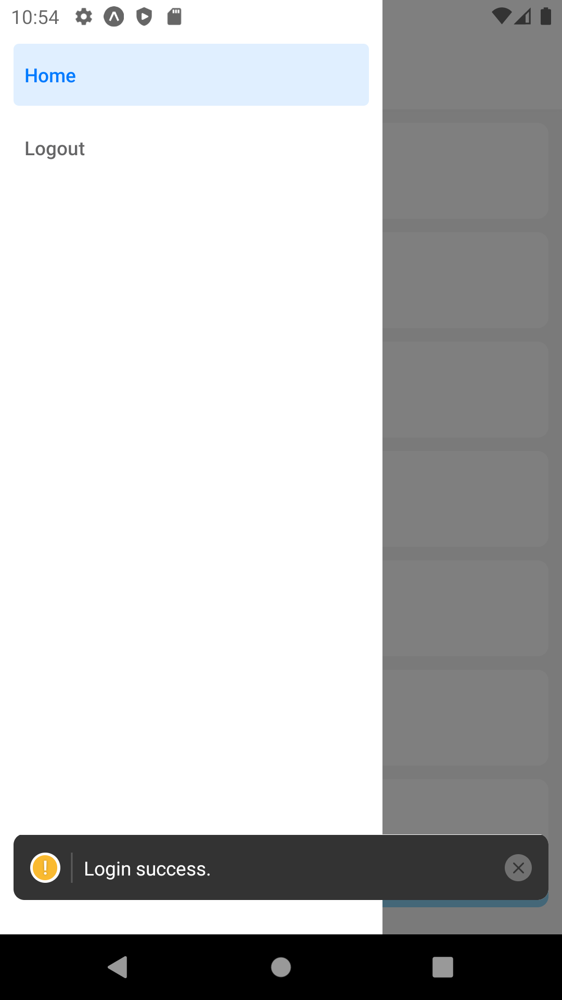
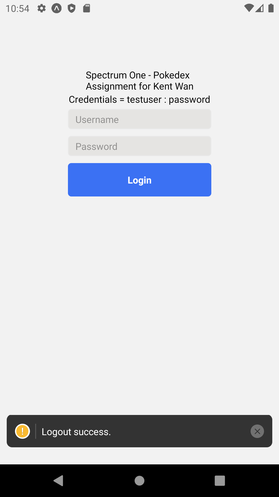
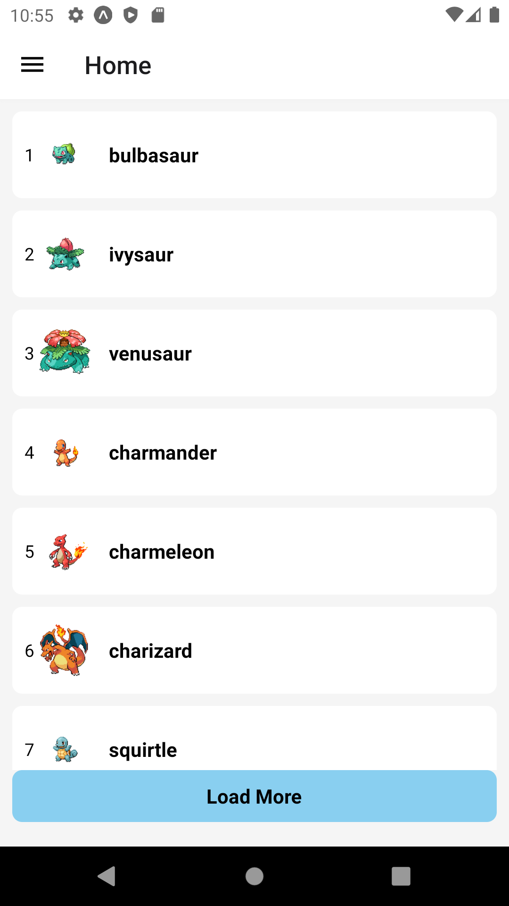
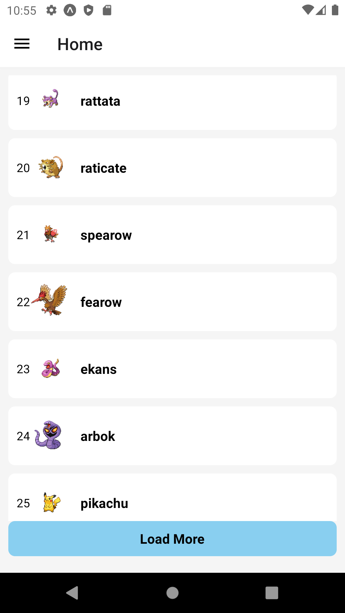
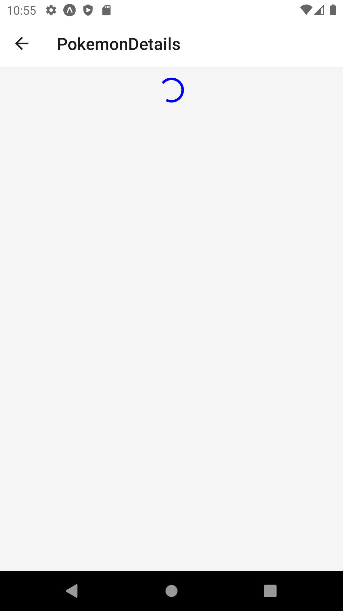
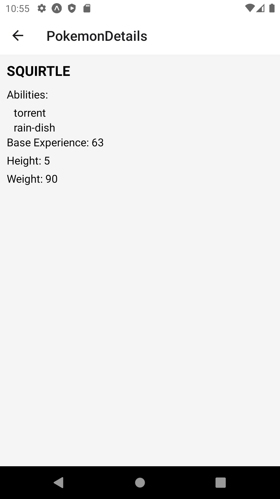

# Spectrum One Take Home Assignment for Kent Wan. Using Expo React Native.

    1. Login Screen with validation, showing wrong credentials.

  

    2. Login Screen with correct credentials.

  

    3. Login Success, navigation to Home Screen.

  

    4. Drawer, showing Home item and Logout item.

  

    5. Logout Success. Cleared user credentials.

  

    6. In homescreen, we have fetch the pokemon list and rendered it to FlatList, together with it's name, image and index + 1 to be visually appealing.

  

    7. When scrolled down, it can reach its end, you need to press the Load More button to fetch more pokemon, update the newOffSet the fetch the new pokedata.

  

    8. Pull to refresh, to reset the pokemonList state and fetch again the latest data from the API.

  

    9. Here is the detailed screen when you press an item from the list. Showing the detail information about the pokemon using the URL from the API response.

.

